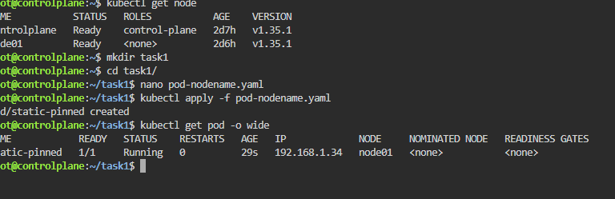
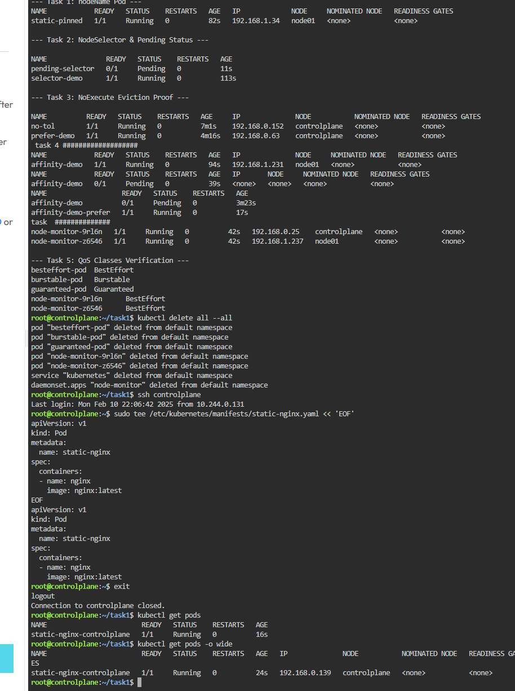
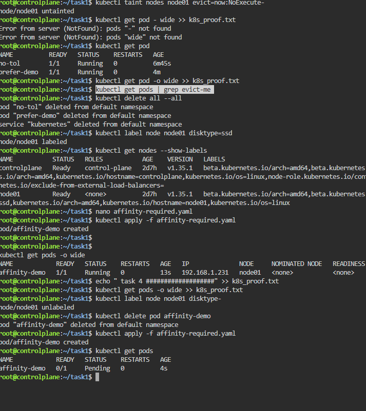

#
K8s_Assignment_7 — README

Overview

This assignment covers advanced Kubernetes scheduling, node management, QoS classes, DaemonSets, and static pods. Each task focuses on specific concepts like nodeName, nodeSelector, taints/tolerations, node affinity, QoS, DaemonSets, and Static Pods.

Task 1: Schedule a Pod on a Specific Node Using nodeName

Objective: Hard-pin a Pod to a node, bypassing the scheduler.

Steps:

Get the node name:
kubectl get nodes
Create Pod YAML (static-pinned.yaml):
apiVersion: v1
kind: Pod
metadata:
  name: static-pinned
spec:
  nodeName: minikube
  containers:
  - name: nginx
    image: nginx:latest
Apply the Pod:
kubectl apply -f static-pinned.yaml
Verify:
kubectl get pod static-pinned -o wide

Proof:

echo "--- Task 1: nodeName Pod ---" > k8s_proof.txt
kubectl get pod static-pinned -o wide >> k8s_proof.txt
Task 2: NodeSelector — Label-based Scheduling

Objective: Schedule pods based on node labels.

Steps:

Label the node:
kubectl label node minikube env=lab
Create Pod YAML with nodeSelector (selector-demo.yaml):
apiVersion: v1
kind: Pod
metadata:
  name: selector-demo
spec:
  nodeSelector:
    env: lab
  containers:
  - name: nginx
    image: nginx:latest
Apply the Pod:
kubectl apply -f selector-demo.yaml
Remove the label and create a second Pod (should be Pending):
kubectl label node minikube env-
kubectl run pending-selector --image=nginx

Proof:

echo -e "\n--- Task 2: NodeSelector & Pending Status ---" >> k8s_proof.txt
kubectl get pod selector-demo -o wide >> k8s_proof.txt
kubectl get pod pending-selector >> k8s_proof.txt 2>&1
Task 3: Test All Three Taint Effects

Objective: Observe behavior of NoSchedule, PreferNoSchedule, NoExecute.

Steps:

Add NoSchedule taint and try scheduling pod without toleration:
kubectl taint nodes minikube test=true:NoSchedule
kubectl run no-tol --image=nginx
Create pod WITH toleration (toleration-pod.yaml):
apiVersion: v1
kind: Pod
metadata:
  name: tol-pod
spec:
  tolerations:
  - key: test
    operator: Equal
    value: 'true'
    effect: NoSchedule
  containers:
  - name: app
    image: nginx
Remove taint, run pod, then add NoExecute:
kubectl taint nodes minikube test=true:NoSchedule-
kubectl run evict-me --image=nginx
kubectl taint nodes minikube evict=now:NoExecute
kubectl get pods -w
Clean up:
kubectl taint nodes minikube evict=now:NoExecute-

Proof:

echo -e "\n--- Task 3: NoExecute Eviction Proof ---" >> k8s_proof.txt
kubectl get pods | grep evict-me >> k8s_proof.txt
Task 4: Node Affinity — Required vs Preferred

Objective: Schedule pods using required and preferred node labels.

Steps:

Label the node:
kubectl label node minikube disktype=ssd
Create Pod YAML (affinity-demo.yaml):
apiVersion: v1
kind: Pod
metadata:
  name: affinity-demo
spec:
  affinity:
    nodeAffinity:
      requiredDuringSchedulingIgnoredDuringExecution:
        nodeSelectorTerms:
        - matchExpressions:
          - key: disktype
            operator: In
            values: [ssd]
      preferredDuringSchedulingIgnoredDuringExecution:
        - weight: 80
          preference:
            matchExpressions:
            - key: zone
              operator: In
              values: [us-east]
  containers:
  - name: nginx
    image: nginx:latest
Apply and verify:
kubectl apply -f affinity-demo.yaml
kubectl describe pod affinity-demo | grep -A15 Affinity
Task 5: QoS Classes — Guaranteed, Burstable, BestEffort

Steps:

Guaranteed Pod:
resources:
  requests:
    cpu: 200m
    memory: 128Mi
  limits:
    cpu: 200m
    memory: 128Mi
Burstable Pod (requests < limits)
BestEffort Pod (no resources field)
Verify QoS class:
kubectl describe pod guaranteed-pod | grep QoS
kubectl describe pod burstable-pod | grep QoS
kubectl describe pod besteffort-pod | grep QoS

Proof:

echo -e "\n--- Task 5: QoS Classes Verification ---" >> k8s_proof.txt
kubectl get pods -o jsonpath='{range .items[*]}{.metadata.name}{"\t"}{.status.qosClass}{"\n"}{end}' >> k8s_proof.txt
Task 6: Deploy a DaemonSet — One Pod per Node

Steps:

Create DaemonSet YAML (node-monitor.yaml):
apiVersion: apps/v1
kind: DaemonSet
metadata:
  name: node-monitor
spec:
  selector:
    matchLabels:
      app: node-monitor
  template:
    metadata:
      labels:
        app: node-monitor
    spec:
      containers:
      - name: monitor
        image: busybox
        command: ['sleep', '3600']
Apply:
kubectl apply -f node-monitor.yaml
Verify:
kubectl get ds node-monitor
kubectl get pods -o wide | grep node-monitor
kubectl get ds -n kube-system
Task 7: Static Pod — Create via Manifest Directory

Steps:

SSH into minikube:
minikube ssh
Create static pod manifest:
sudo tee /etc/kubernetes/manifests/static-nginx.yaml << 'EOF'
apiVersion: v1
kind: Pod
metadata:
  name: static-nginx
spec:
  containers:
  - name: nginx
    image: nginx:latest
EOF
Exit SSH and verify pod appears:
kubectl get pod static-nginx-minikube
Try deleting (pod will return):
kubectl delete pod static-nginx-minikube && sleep 5
kubectl get pods
Delete permanently by removing manifest:
sudo rm /etc/kubernetes/manifests/static-nginx.yaml

Proof:

echo -e "\n--- Task 7: Static Pod Proof ---" >> k8s_proof.txt
kubectl get pods -o wide | grep "\-minikube" >> k8s_proof.txt

# Scheduling
